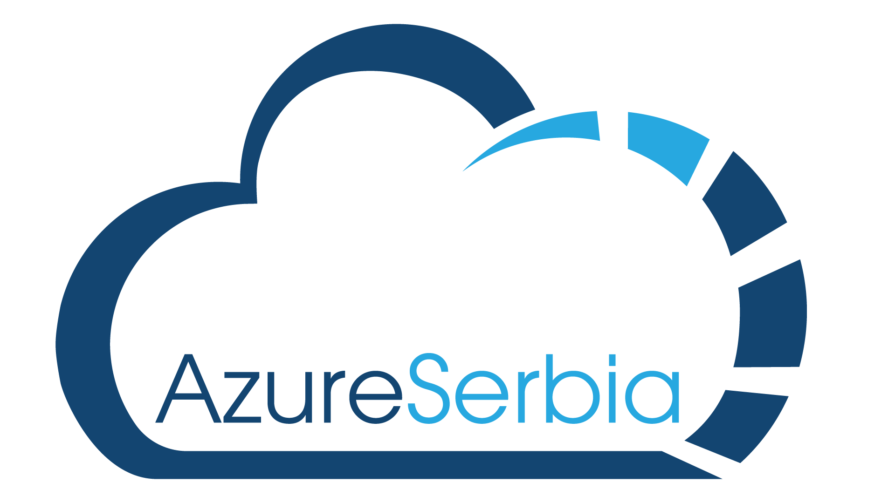

# Azure Serbia User Group
Repository for presentations and code files used on Azure Serbia User Group meetings.

|**Date**|**Speaker**|**Session**|**Content**|**Presentation Video**|
|-|-|-|-|-|
|05.05.2020.|Vladimir Stefanovic|Containers in Azure 101|[Deck & Demos](https://github.com/azure-serbia/user-group-meetings/blob/master/decks%20and%20demos/vladimir-stefanovic-containers-in-azure-101.zip?raw=true)|[YouTube Video](https://youtu.be/eqHIKMyD18U)|
|26.05.2020.|Pascal Naber|Introduction to Kubernetes using AKS|[Deck & Demos](https://github.com/azure-serbia/user-group-meetings/blob/master/decks%20and%20demos/pascal-naber-introduction-to-kubernetes-using-aks.pdf)|[YouTube Video](https://youtu.be/bbvj5Xg5St0)|
|16.06.2020.|Srdjan Zivojinovic|Azure Key Vault i .NET Core|[Deck & Demos](https://github.com/zsrdjan/presentations/tree/master/azure-meetup-key-vault)|[YouTube Video](https://www.youtube.com/watch?v=6t2mR_wKjS4)|
|14.07.2020.|Thomas Maurer|Manage and govern your hybrid servers using Azure Arc|[Deck & Demos](https://github.com/azure-serbia/user-group-meetings/blob/master/decks%20and%20demos/thomas-maurer-manage-and-govern-your-hybrid-servers-using-azure-arc.pdf)|[YouTube Video](https://www.youtube.com/watch?v=bSWEQhXtSl4)|
|10.09.2020.|Mustafa Toroman|Gdje je sigurnost u DevOps?|[Deck & Demos]()|[YouTube Video](https://youtu.be/sYK_1x_CP3o)|
|05.11.2020.|Milos Katinski|DevOps through the prism of the Sys Admins||[YouTube Video](https://youtu.be/_pwrvVn8ci0)|
